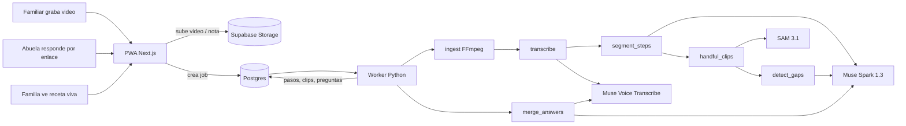

# Arquitectura

```mermaid
flowchart LR
  U1[Familiar graba video] --> W[PWA Next.js]
  U2[Abuela responde por enlace] --> W
  U3[Familia ve receta viva] --> W
  W -->|sube video / nota| S[(Supabase Storage)]
  W -->|crea job| DB[(Postgres)]
  DB --> K[Worker Python]
  K --> P1[ingest FFmpeg] --> P2[transcribe] --> P3[segment_steps] --> P4[handful_clips] --> P5[detect_gaps]
  K --> P6[merge_answers]
  P2 --> VT[Muse Voice Transcribe]
  P6 --> VT
  P3 --> SP[Muse Spark 1.3]
  P5 --> SP
  P6 --> SP
  P4 --> SAM[SAM 3.1]
  K -->|pasos, clips, preguntas| DB
```

Regla: cada paso enlaza su clip; las medidas se muestran, nunca se inventan.
